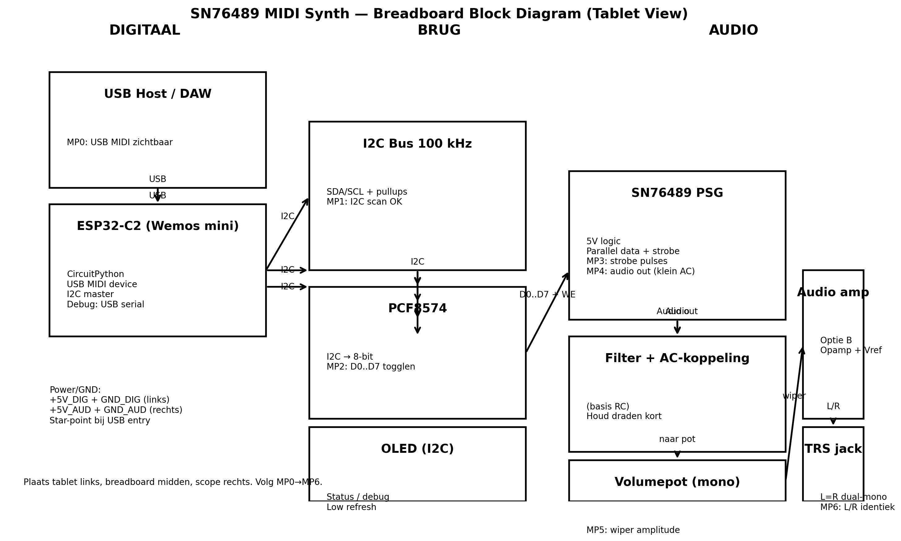

- Dit punt ligt **bij de voeding / USB-entry**
- Audio-ground mag **nooit** via ESP32 of I2C teruglopen

---

## 3. Digitale sectie – wiring details

### 3.1 ESP32-C2

- Voeding: via USB
- Gebruik alleen:
  - SDA
  - SCL
  - 1–2 GPIO’s voor SN76489 control (via PCF)
- Geen lange jumper wires (>10 cm = fout)

### 3.2 I2C-bus

- SDA + SCL getwist of parallel naast elkaar
- Pull-ups: 4.7–10 kΩ naar **+5 V_DIG**
- Devices:
  - PCF8574
  - OLED

Testregel:
- Eerst I2C scan → dan pas SN76489 aansluiten

---

## 4. PCF8574 → SN76489 wiring

### 4.1 Parallel data

- PCF8574 D0–D7 → SN76489 data bus
- Draden:
  - zo kort mogelijk
  - naast elkaar (geen kruisende audio)

### 4.2 Control lines

- WE / strobe apart en zichtbaar routen
- Label op breadboard (tape!) aanbevolen

Meetpunt MP2 / MP3:
- Je moet hier met de scope **duidelijk pulsen** zien

---

## 5. Audio sectie – wiring details (Optie B leidend)

### 5.1 SN76489 audio out

- AC-koppeling **direct bij SN76489**
- Daarna pas draad richting potmeter

Fout:
- Eerst lange draad → dan C_in (pikt rommel op)

### 5.2 Potmeter

- Mono, 10–50 kΩ log
- Aansluiting:
  - boven: audio in
  - midden: wiper → versterker
  - onder: GND_AUD

### 5.3 Opamp-versterker (Optie B)

- Zo dicht mogelijk opgebouwd
- Decoupling:
  - 100 nF direct tussen VCC en GND
  - Cref (47–100 µF) bij Vref-node
- Vref-buffer fysiek dichtbij opamp

### 5.4 TRS jack

- Tip = L
- Ring = R
- Sleeve = GND_AUD
- Serie-R en C_out **vlakbij jack**

---

## 6. Absolute breadboard no-go’s

- ❌ Audio en I2C draden door elkaar
- ❌ GND-lussen
- ❌ Lange ongefilterde audio-ingang
- ❌ Geen decoupling “omdat het ook zonder werkt”
- ❌ Alles op één rail “want dat is makkelijker”

---

## 7. Bouwvolgorde (afdwingend)

### Fase 1 – Digitaal leven
1. ESP32 → USB
2. USB MIDI zichtbaar
3. OLED werkt
4. I2C scan ziet PCF8574

### Fase 2 – Parallel output
5. PCF8574 outputs togglen (LED of scope)
6. Strobe-lijn zichtbaar op scope

### Fase 3 – PSG
7. SN76489 aangesloten
8. Eenvoudige “beep” via vaste waarde
9. Audio zichtbaar op scope (MP4)

### Fase 4 – Audio pad
10. Potmeter werkt (MP5)
11. Opamp versterkt correct
12. Koptelefoon-uitgang schoon (MP6)

**Niet doorbouwen als een eerdere fase niet klopt.**

---

## 8. Meetplan (samenvatting MP0–MP6)

| Meetpunt | Wat | Verwachting |
|--------|-----|-------------|
| MP0 | USB MIDI | Device zichtbaar |
| MP1 | I2C scan | OLED + PCF ACK |
| MP2 | PCF data | Bits togglen |
| MP3 | Strobe | Duidelijke pulses |
| MP4 | PSG audio | Klein AC signaal |
| MP5 | Potmeter | Variërende amplitude |
| MP6 | Jack L/R | Identiek signaal |

---

## 9. Succescriteria Stap 4

Stap 4 is geslaagd als:
- Breadboard visueel logisch is
- Elk blok apart meetbaar is
- Ruis en fouten **herleidbaar** zijn
- Je zonder schema kunt uitleggen wat waar gebeurt

---

## Volgende stap
**Stap 5 – Audio-opties evaluatie (A/B/C)**  
→ Optie A en B zijn nu uitgewerkt  
→ Optie C kan nog toegevoegd worden  
→ Daarna: definitieve keuze voor PCB

